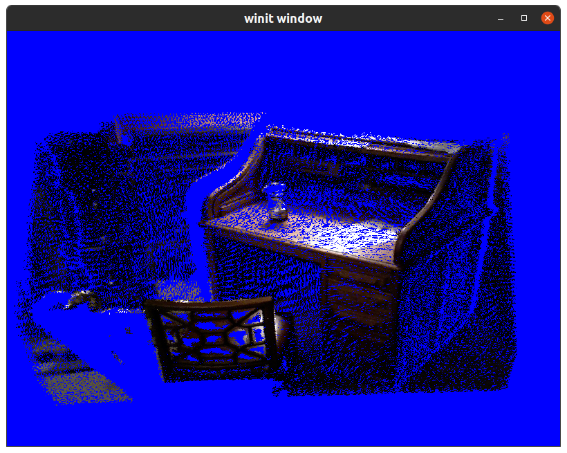

# Align3D

Align3D is a versatile project written in Rust that aligns range images and point clouds using the Iterative Closest Point (ICP) algorithm.
It provides functionalities to integrate range images into surfels, read and write .ply and .off files, read the TUM and IL-RGBD datasets, and visualize point clouds, surfels, and other geometries. 
Additionally, it includes processing utilities such as normal vector computation for range images and a bilateral filter for depth images.

* Alignment of range images and point clouds using the Iterative Closest Point (ICP) algorithm.
* Integration of range images into surfels for efficient representation and rendering.
* Reading and writing of .ply and .off files for easy data exchange.
* Support for the TUM and IL-RGBD datasets for convenient input.
* Visualization of point clouds, surfels, and other geometries to inspect the results.
* Processing utilities like normal vector computation for range images and bilateral filtering for depth images.

Align3D leverages several Rust libraries to provide its functionality:

* [ndarray](https://github.com/rust-ndarray/ndarray) for efficient multi-dimensional array processing;
* [nalgebra](https://nalgebra.org/) for linear algebra operations;
* [vulkano](https://vulkano.rs/) with Vulkan for high-performance computing and rendering capabilities.
* [image](https://github.com/image-rs/image) is used for image processing tasks. By harnessing the capabilities of these libraries

## Getting it

Clone the Align3D repository:

```bash
git clone https://github.com/otaviog/align3d
```
Change into the project directory:

```bash
cd align3d
```

Build the project using Cargo:

```bash
cargo build --release
```

Add to your project's `Cargo.toml`:

```toml
align3d = {path = "<your/align3d/path>" }
```

## Sample use

The following code do the following:

* loads the IndoorLidarDataset;
* computes the odometry for 20 frames;
* display the metrics comparing with the ground truth;
* and shows the alignment results.

```rust
use align3d::{
    bilateral::BilateralFilter,
    icp::{multiscale::MultiscaleAlign, MsIcpParams},
    io::dataset::{IndoorLidarDataset, RgbdDataset, SubsetDataset},
    metrics::TransformMetrics,
    range_image::RangeImageBuilder,
    trajectory_builder::TrajectoryBuilder,
    viz::rgbd_dataset_viewer::RgbdDatasetViewer,
};

fn main() -> Result<(), Box<dyn std::error::Error + 'static>> {
    // Load the dataset
    let dataset = Box::new(SubsetDataset::new(
        Box::new(IndoorLidarDataset::load("tests/data/indoor_lidar/bedroom")?),
        (0..20).collect(),
    ));

    // RangeImageBuilder composes the processing steps when loading RGB-D frames (or `RangeImage`).
    let range_image_transform = RangeImageBuilder::default()
        .with_intensity(true) // Use intensity besides RGB
        .with_normals(true) // Compute the normals
        .with_bilateral_filter(Some(BilateralFilter::default())) // Apply bilateral filter
        .pyramid_levels(3); // Compute 3-level Gaussian pyramid.

    // Default ICP parameters
    let icp_params = MsIcpParams::default();

    // TrajectoryBuilder accumulates the per-frame alignment to form the odometry of the camera poses.
    let mut traj_builder = TrajectoryBuilder::default();

    // Use the `.build()` method to create a RangeImage pyramid.
    let mut prev_frame = range_image_transform.build(dataset.get(0).unwrap());

    // Iterate over the dataset
    for i in 1..dataset.len() {
        let current_frame = range_image_transform.build(dataset.get(i).unwrap());
        
        // Perform ICP alignment
        let icp = MultiscaleAlign::new(icp_params.clone(), &prev_frame).unwrap();
        let transform = icp.align(&current_frame);

        // Accumulate transformations for obtaining odometry
        traj_builder.accumulate(&transform, Some(i as f32));
        prev_frame = current_frame;
    }

    // Compute metrics in relation to the ground truth
    // Get the predicted trajectory
    let pred_trajectory = traj_builder.build();
    
    // Get the ground truth trajectory
    let gt_trajectory = &dataset
        .trajectory()
        .expect("Dataset has no trajectory")
        .first_frame_at_origin();

    // Compute the metrics
    let metrics = TransformMetrics::mean_trajectory_error(&pred_trajectory, &gt_trajectory)?;
    println!("Mean trajectory error: {}", metrics);

    // Visualization part
    RgbdDatasetViewer::new(dataset)
        .with_trajectory(pred_trajectory.clone())
        .run();

    Ok(())
}

```

```txt
Mean trajectory error: angle: 1.91°, translation: 0.03885
```

and show a window like this:



(move the camera using WASD controls)


# Benchmarking

| Functionality | Input desc.                                    |[min, mean, max]                 |
|---------------|------------------------------------------------|---------------------------------|
| image icp     | 3-level pyramid of 640x480 inputs              | [101.91 ms 103.01 ms 104.29 ms] |
| kdtree        | 500000 database vs 500000 queries of 3D points | [101.48 ms 101.75 ms 102.04 ms] |
| compute_normals | 640x480 RGB-D frame                          | [1.1587 ms 1.1778 ms 1.2005 ms] |

* Hardware: 11th Gen Intel® Core™ i7-11800H @ 2.30GHz × 16

# Contributing

Contributions to Align3D are welcome! If you find any issues or have suggestions for improvements, please create a new issue or submit a pull request.

# License

Align3D is licensed under the MIT License.

# Release Plan

Align3D is an experimental project that showcases the potential of using Rust for writing computer vision applications.
While still being a experimental project, it shows the versatility and performance benefits that Rust offers compared to the traditional combination of C++ and Python commonly used in computer vision and machine learning.

The project has the following Road map:

* [x] Bug fixes in PCL ICP.
* [ ] Optimize Image Icp performance
* [ ] Optimize 3D rendering pipeline
* [ ] Python bindings
* [ ] Improve UX of the 3D viewer
* [x] Surfel fusion v1.0.0
      * Only merging of incoming to model surfels.
* [ ] Surfel fusion v1.1.0
      * Use merging of model surfels and space carving.
* [ ] Frame-to-model SLAM with surfels
* [ ] Alignment using sparse features
      * Sift and deep learning ones
* [ ] Submap SLAM
* [ ] Pose Graph build and optimization
